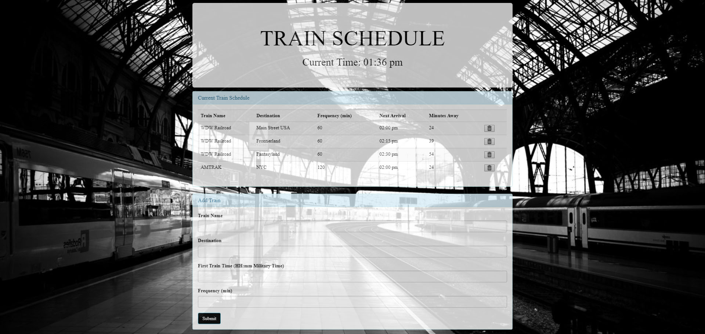

# Train Scheduler
 https://cjsummers003.github.io/TrainSchedule

 <h4> * This Train Scheduler will allow the user to see how much time until the next train arrives as well as add a train to the schedule.</h4>
<h4> * The Schedule will show the Train, Destination, Frequency, Arrival Time and How long until the next train.</h4>

<h4> * Once the User adds a train it will show the next train closest to the current time. Which the current time will be displayed at the top once a train has been added.</h4>

<h2>External Resources used</h2>
<ul>
    <li>Bootstrap</li>
    <li>JQuery</li>
    <li>Momentjs</li>
    <li>Firebase</li>
</ul>

<h2>Author</h2>
<h3>CJ Summers - HTML/CSS/JavaScript
